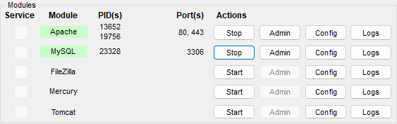

**Inclusipet** é um site desenvolvido para um projeto que dura 2 anos ( 2023 - 2024 ) com uma empresa parceira no curso de Desenvolvimento de Sistemas AMS da Etec da Zona Leste.
[**Link do Github Pages**](https://chrb09.github.io/InclusipetProject/)

# Sumário

- [Sumário](#sumário)
  - [🤔 Sobre a Inclusipet](#-sobre-a-Inclusipet)
  - [📖 Funcionalidades do Sistema](#-funcionalidades-do-sistema)
  - [✅ Tecnologias Utilizada](#-tecnologias-utilizadas)
    - [Front end](#front-end-)
    - [Back end](#back-end-)
    - [Biblioteca ](#biblioteca-)
    - [Framework ](#framework-)
  - [📁 Rodando o Projeto](#-rodando-o-projeto)
  - [❓ FAQ](#-FAQ)
  - [💻 Roadmap](#-roadmap)
  - [🐕 Contribuidores](#-contribuidores)

## 🤔 Sobre a Inclusipet

O diferencial da **Inclusipet** é o seu foco em animais que necessitam de cuidados especiais sendo construído com esse foque em mente tendo funcionalidades especializadas para o tratamento de tais, focando no atendimento online para praticidade dos donos.
<br>

## 📖 Funcionalidades do sistema

Algumas das funcionalidade incluem um sistema de login e cadastro do tutor do pet e do funcionario que podem guardar informações do usuário que permitem o uso do sistema de agendamento e cadastro de pet, além de permitir funcionalidades como acompanhar o progresso de exames e consultas, também temos um sistema de adoção que pode criar um anuncio com informações sobre o pet que precisa de um novo lar, tudo com conexão para o banco de dados usando PHP e MySQl (MariaDB).
<br>

## ✅ Tecnologias utilizadas

### Front-end: <br>


### Back-end: <br>


### Biblioteca: <br>


### Framework: <br>


<br>

## 📁 Rodando o projeto

Clone o repositorio localmente

```bash
  # Entre na sua pasta htdocs no local de instalação de seu XAMPP
  cd C:/xampp/htdocs
  # Clone o repositorio
  git clone https://github.com/Chrb09/InclusipetProject
```

Inicie os serviços Apache & MySQL do XAMPP



Abra o phpMyAdmin no diretorio ROOT e importe o banco de dados em:

```bash
C:\xampp\htdocs\InclusipetProject\controller\bd_inclusipet.sql
```

Digite o URL do projeto em sua barra de pesquisa

```bash
http://localhost/inclusipetProject/view/pages/index/index.php
```

## ❓ FAQ

### **O site está finalizado?**

Não, o projeto ainda está em desenvolvimento e terá sua finalização no final de 2024.

### **Qual o envolvimento da empresa parceira neste projeto?**

O projeto Inclusipet é um projeto interdisciplinar e contra-turno do curso de desenvolvimento de sistemas AMS, este consiste em uma integração com uma multinacional parceira que tem a função de mentoria e direcionamento do projeto.

### **Qual o motivo da criação desse projeto?**

O projeto foi criado com o intuito de simular uma interação entre cliente e desenvolvedor para os alunos do curso, preparando-os para o mercado de trabalho, sendo esse o intuito da instituição Etec ZL.

### **O Design do site foi criado com qual ferramenta?**

O site foi criado utilizando [ **Figma**](https://www.figma.com/file/L4PJEj1teaiU0Gs0vkBkwf/Figma-Inclusipet-Oficial?type=design&node-id=0-1&mode=design&t=fGISzfXShJrtB8nw-0).

### **O BackEnd Está pronto?**

Não, ele ainda está em desenvolvimento.
<br>

## 💻 Roadmap

- Adicionar Backend

- Adicionar Banco de dados

- Melhorar o suporte de navegadores

- Otimzar o código

<br>

## 🐕 Contribuidores

<div align=center>
  <table>
    <tr>
      <td align="center">
        <a href="https://github.com/Amanda093">
          <br>
          <sub>
            <b>Amanda</b>
          </sub> <br>
        </a>
        <sub>
          Código, Design, Conteúdo , Documentação
        </sub>
      </td>
      <td align="center">
        <a href="https://github.com/Beatriz02020">
          <br>
          <sub>
            <b>Beatriz</b>
          </sub> <br>
        </a>
        <sub>
            Código, Conteúdo, Documentação. Responsividade
          </sub>
      </td>
      </td>
      <td align="center">
        <a href="https://github.com/BernardoVxexra">
          <br>
          <sub>
            <b>Bernardo</b>
          </sub> <br> 
        </a>
        <sub>
            Conteúdo, Documentação
        </sub>
      </td>
      <td align="center">
        <a href="https://github.com/Chrb09">
          <br>
          <sub>
              <b>Carlos</b>
            </sub> <br>
        </a>
        <sub>
            Código, Design, Conteúdo, Documentação, Responsividade
          </sub>
      </td>
      </td>
      <td align="center">
        <a href="https://github.com/GiovannaAdantas">
          <br>
          <sub>
            <b>Giovanna</b>
          </sub> <br>
        </a>
        <sub>
            Conteúdo, Documentação
          </sub>
      </td>
    </tr>
  </table>
<div>
